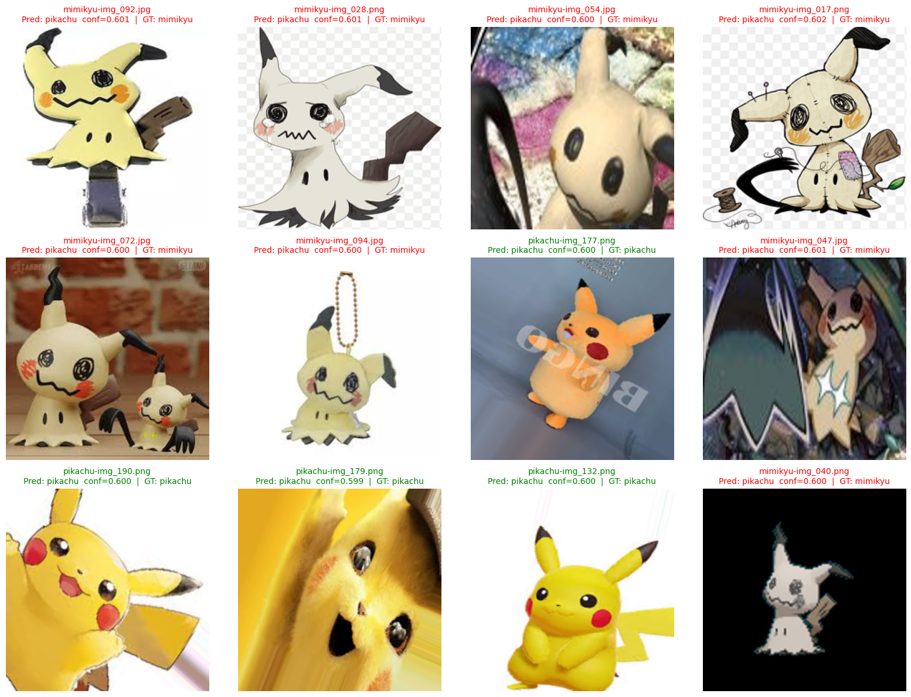

# Project_Pokemon-Mimikyu_NeuroVision

  

專案簡介，Project_Pokemon-Mimikyu_NeuroVision 是一個基於 TensorFlow/Keras 的影像分類專案，專門用來辨識寶可夢 **Mimikyu** 與 **Pikachu**。Mimikyu（日語：ミミッキュ）是一種會偽裝成 Pikachu 的寶可夢，原因在於為了獲得更多朋友。由於外觀相似，對模型來說辨識具有挑戰性。本專案目的是使用 __深度學習模型（Deep Learning）__ 中的 EfficientNetB0 CNN 模型（EfficientNetB0 是一種卷積神經網路（CNN）架構（以 MBConv/inverted residual＋Squeeze-and-Excitation 為核心，並採用 compound scaling）作為影像分類骨幹，用來辨識寶可夢 Mimikyu 與 Pikachu 的二分類任務。

### 🎯 專案目標
1. **建立高準確度分類模型**  
   使用 EfficientNetB0 作為骨幹網路（Backbone），在有限的資料下達到最佳分類效果。
2. **解決外觀相似的分類挑戰**  
   Mimikyu 與 Pikachu 在外觀上有高度相似性，模型需能正確分辨兩者。
3. **提供可重現的訓練流程**  
   包含資料增強、模型訓練、微調（Fine-tuning）與最佳權重儲存。
4. **支援單張與批量推論**  
   方便部署與展示模型推論結果。
5. **便於深度學習模型部署**  
   支援輸出 `.keras` 與 `.h5` 格式，方便在不同環境載入與使用。

### 📊 資料集說明
本專案的資料集格式與 [Kaggle: Pokémon Gen 1 - 151 Classes Classification](https://www.kaggle.com/datasets/hongdcs/pokemon-gen1-151-classes-classification) 類似，但僅保留 **Mimikyu** 與 **Pikachu** 兩類，並依照訓練需求進行資料切分。

### 🛠️ 使用技術

**(1) 建模與資料分析工具**
- 語言與環境：Python 3.x、Jupyter Notebook
- 資料處理：Pandas、NumPy、Pillow（影像 I/O／resize／格式轉換）
- 視覺化：Matplotlib（學習曲線、ROC、推論結果網格）
- 深度學習（TensorFlow/Keras，神經網路）：
    - 前處理／資料增強：Keras Preprocessing Layers（Rescaling、RandomFlip、RandomRotation、RandomZoom、RandomContrast）
    - 架構／骨幹：EfficientNetB0（ImageNet 預訓練，CNN）、Keras Functional API（增強層＋Backbone＋分類頭 Dense(2, softmax)）
    - 訓練與最佳化：Adam、SparseCategoricalCrossentropy（logits/softmax 依實作對應）、學習率設定（可含 warmup／decay 規劃）
    - 驗證與選模：ModelCheckpoint（最佳權重保存）、EarlyStopping（以驗證集監控）、train/validation split（tf.data）
    - 指標：accuracy、（可選）AUC、roc_curve、confusion_matrix、classification_report、學習曲線（loss／accuracy）
    - 管線化：tf.data（cache／shuffle／prefetch）、Callbacks（ModelCheckpoint、EarlyStopping）、模型匯出（.keras／.h5）

**(2) 建模與分析流程**

A. 資料準備

   1. 資料集：二類（Mimikyu、Pikachu），依訓練需求切分 Train/Val/Test。
   2. 增強策略：於輸入端套用隨機翻轉、旋轉、縮放、對比度等，以提升泛化。
   3. 資料管線：以 tf.data 建立高效批次載入與預取，確保訓練吞吐。

B. **神經網路**建構（CNN）

   1. Backbone：載入 EfficientNetB0 (include_top=False, weights="imagenet")。
   2. 分類頭：Global pooling → Dense(2, softmax) 建立二分類輸出。
   3. 模型組裝：將增強層、Backbone 與分類頭以 Keras Functional API 接起。

C. **深度學習模型**訓練

   1. Compile：optimizer=Adam、loss=SparseCategoricalCrossentropy、metrics=["accuracy"]。
   2. Stage-1（凍結訓練）：凍結骨幹（特徵抽取器），只訓練分類頭以穩定收斂。
   3. Stage-2（微調）：解凍部分高層卷積層，建議持續凍結 BatchNorm 以避免統計量漂移；視學習率與層數逐步展開。
   4. 檢查點與早停：以 ModelCheckpoint 保存最佳權重，EarlyStopping 基於驗證集監控收斂。

D. 評估與診斷

   1. 整體表現：在驗證 / 測試集上輸出 accuracy（可另計 AUC）。
   2. 決策門檻：以 roc_curve 找到最佳門檻，並觀察 Precision/Recall 取捨。
   3. 錯誤分析：混淆矩陣與樣本級可視化（批量推論網格），定位常見誤判型態。
   4. 學習曲線：Loss/Accuracy 隨 Epoch 變化，檢測過擬合或欠擬合。

E. 推論與部署

   1. 單張推論：封裝 predict_image(path)，回傳類別與信心分數。
   2. 批量推論：對資料夾或清單批次預測並輸出圖表。
   3. 模型輸出：匯出 .keras / .h5 完整模型（含架構與權重），於任意支援環境載入部署。

### 📊 批量推論結果

以下為模型在測試集（Test set）上隨機抽樣 12 張圖片進行批量推論的結果：

  

